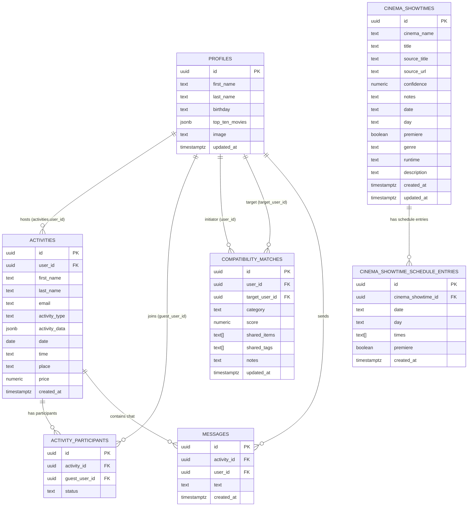

# Supabase Schema and Relationships

This is the data model currently implied by application code.

## Tables referenced in code

- `profiles`
- `activities`
- `activity_participants`
- `compatibility_matches`
- `messages`
- `cinema_showtimes`
- `cinema_showtime_schedule_entries`
- `chat_rooms` *(declared in enum, not actively used in current flows)*
- `chat_room_participants` *(declared in enum, not actively used in current flows)*

## Relationship graph

## Important constraints implied by code

- `compatibility_matches` uses upsert conflict target:
  - `user_id, target_user_id, category`
  - This implies a unique constraint should exist on that tuple.
- `activity_participants` insert handles duplicate join request with Postgres code `23505`
  - This implies a unique constraint likely exists for one participant per activity, typically:
    - `(activity_id, guest_user_id)`
- Missing-row checks in some queries rely on `.single()` behavior and Supabase error codes.

## RPC usage

- `add_review(target_id, new_rating)` is called from `useActivity`.
  - This function is expected to live in Supabase Postgres as a custom RPC function.

## Notes on declared-but-unused tables

`TABLE_ENUM` includes `chat_rooms` and `chat_room_participants`, but current chat flow is activity-scoped via `messages.activity_id`.
