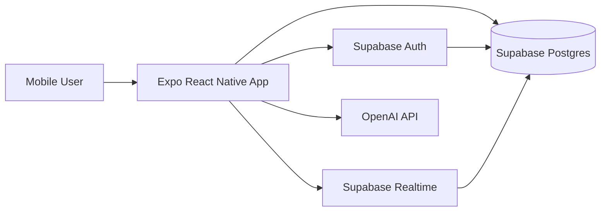

# System Overview

Hang Out is an Expo + React Native app backed by Supabase for auth, persistence, and realtime.

## Tech stack

- **Frontend:** Expo, React Native, Expo Router
- **State/Form:** React hooks, `react-hook-form`
- **Backend-as-a-service:** Supabase Auth + Postgres + Realtime + RPC
- **AI layer:** OpenAI API (`gpt-4o-mini`) via `ai/analyzeMatch.ts`

## High-level architecture

## Main domains

- **Identity and profile**
  - Sign up / sign in
  - Profile record (`profiles`)
  - Favorite movies (`top_ten_movies`)
- **Social activities**
  - Activity creation (`activities`)
  - Join requests + status (`activity_participants`)
- **Compatibility**
  - AI-generated compatibility record (`compatibility_matches`)
- **Chat**
  - Activity-scoped messages (`messages`)
  - Realtime inserts for incoming messages

## Source pointers

- Supabase client setup: `services/Supabase.ts`
- Table names: `constants/tableEnums.ts`
- Auth screens: `app/(auth)/login.tsx`, `app/(auth)/register.tsx`
- Profile logic: `hooks/useProfile.ts`, `components/ProfileForm/ProfileForm.tsx`
- Activities: `components/AddActivityForm/AddActivityForm.tsx`, `services/ActivityService.ts`
- Join/participant logic: `components/ActivityCard/hooks/useActivity.ts`
- AI matching: `components/ActivityPosterDetails/ActivityPosterDetails.tsx`, `ai/analyzeMatch.ts`
- Chat: `hooks/useChat.ts`, `app/(chat)/[id].tsx`
