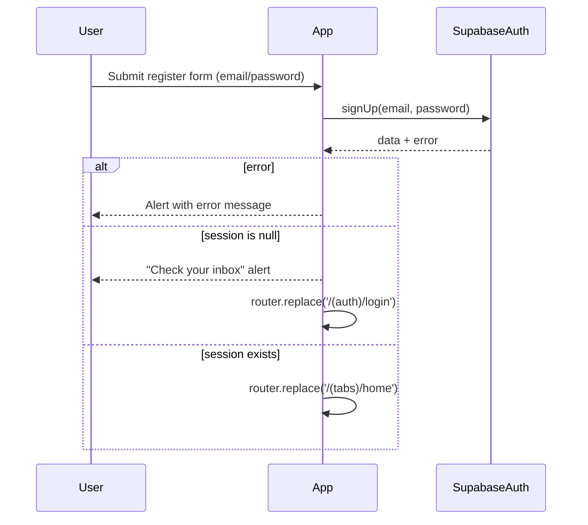
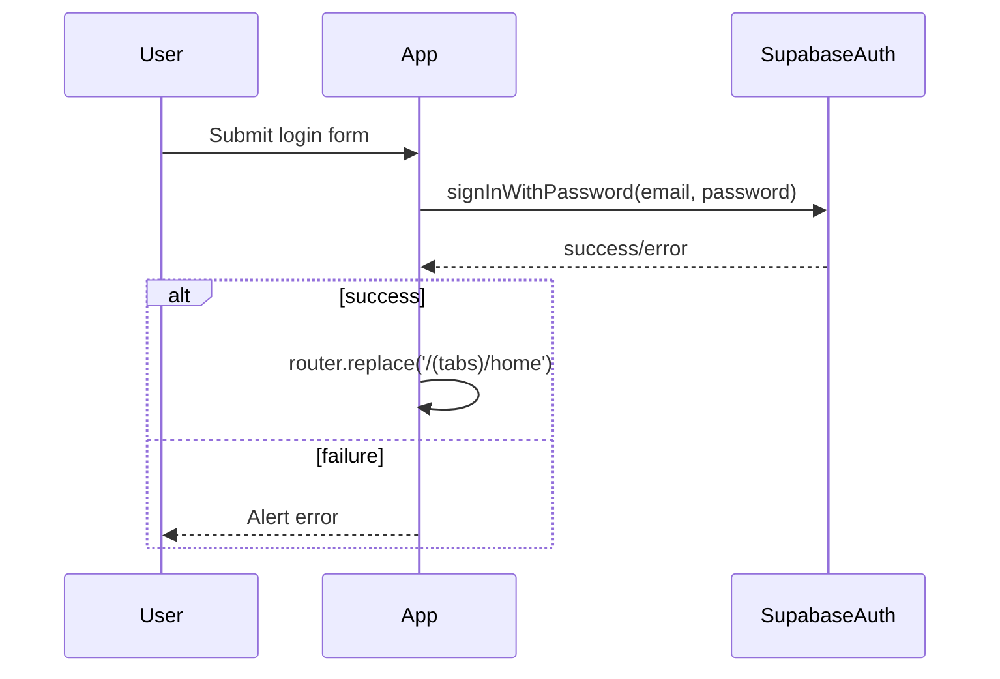

# Account Onboarding Flow

This flow covers sign-up, email verification branch, login, and app routing.

## Signup flow

Code references:

- `app/(auth)/register.tsx`
- `app/_layout.tsx` (auth-aware routing)

## Login flow

Code references:

- `app/(auth)/login.tsx`

## Session-aware route guarding

Code references:

- `app/_layout.tsx`

On app startup:

1. Loads session via `supabase.auth.getSession()`
2. Subscribes to `onAuthStateChange`
3. Redirects based on current route segment:
   - unauthenticated users -> `/(auth)/login`
   - authenticated users in auth screens -> `/(tabs)/home`
