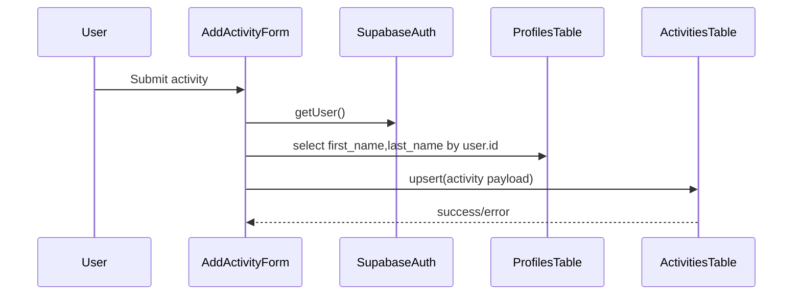
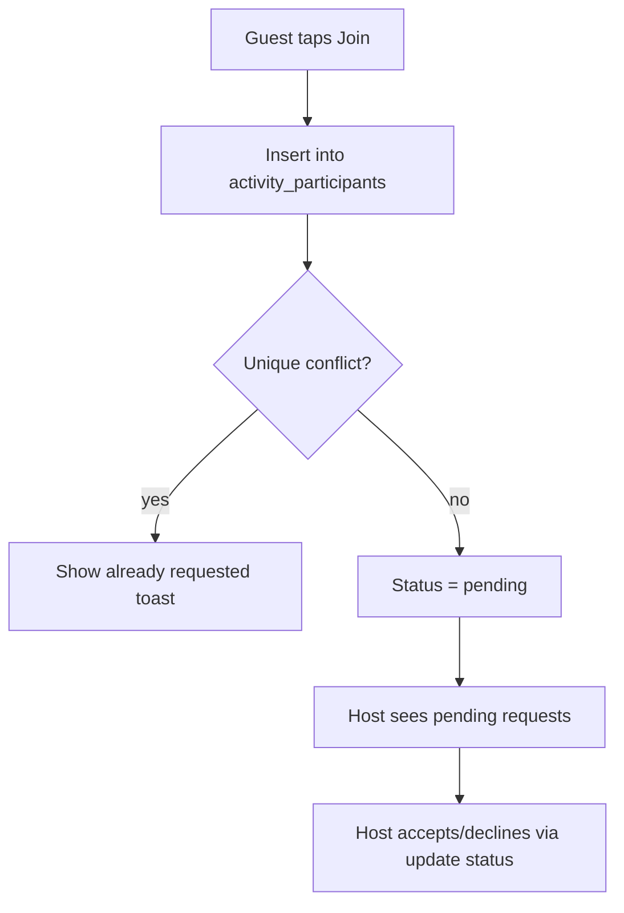

# Activity Lifecycle Flow

This flow covers creating an activity, browsing it, joining it, and host-side request management.

## Create activity

Code references:

- `components/AddActivityForm/AddActivityForm.tsx`
- `services/ActivityService.ts`

## Home feed loading

Code references:

- `services/ActivityService.ts`
- `app/(tabs)/home.tsx`

- `fetchAllActivities()` loads all and filters out current user's own activities.
- `fetchCurrentUserActivities()` loads activities where `user_id = currentUser`.

## Join request flow

Code references:

- `components/ActivityCard/hooks/useActivity.ts`

## Status model

`ACTIVITY_STATUS_ENUM`:

- `pending`
- `accepted`
- `declined`
- `completed`

## Completion side effects

When host completes activity (`handleCompleteActivity`):

1. Calls RPC `add_review(target_id, new_rating)`
2. Deletes related chat messages by `activity_id`
