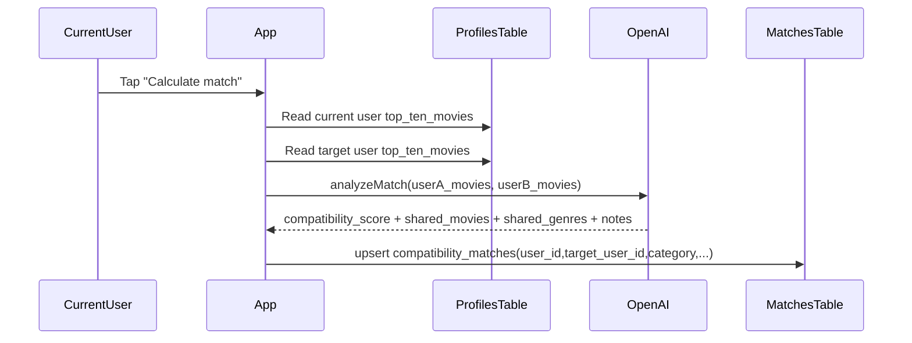

# AI Compatibility Match Flow

This flow describes how compatibility between two users is computed and stored.

## Entry point

Code reference:

- `components/ActivityPosterDetails/ActivityPosterDetails.tsx`

The user taps **Calculate match** in an activity card context.

## Step-by-step

## AI contract

Code reference:

- `ai/analyzeMatch.ts`

Expected AI JSON payload:

- `compatibility_score: number`
- `shared_movies: string[]`
- `shared_genres: string[]`
- `notes: string`

## Persistence model

Code reference:

- `components/ActivityPosterDetails/ActivityPosterDetails.tsx`

Mapped into `compatibility_matches`:

- `score <- compatibility_score`
- `shared_items <- shared_movies`
- `shared_tags <- shared_genres`
- `notes <- notes`
- upsert conflict key: `user_id,target_user_id,category`

## Read model

In profile screen AI tab (`app/(profile)/profile-screen/[id].tsx`):

- Reads one row from `compatibility_matches` for:
  - current user as initiator (`user_id`)
  - viewed profile user as target (`target_user_id`)
