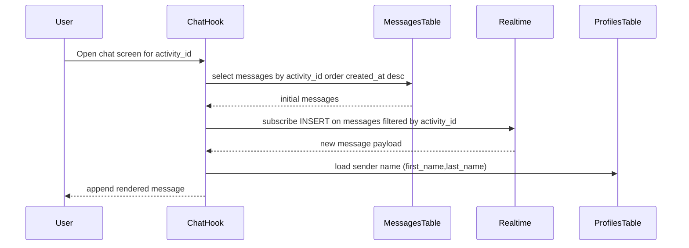

# Chat Flow

Chat is currently modeled as activity-scoped messaging.

## Tables involved

- `messages`
- `profiles` (for sender display name hydration)

## Message load + realtime

Code references:

- `hooks/useChat.ts`
- `app/(chat)/[id].tsx`

## Send flow

1. Message is optimistically appended in UI.
2. Insert into `messages` with:
   - `activity_id`
   - `user_id`
   - `text`

## Notes

- `chat_rooms` and `chat_room_participants` are defined in `TABLE_ENUM` but not used in current flow.
- Current chat identity for avatar uses a local static image in code.
