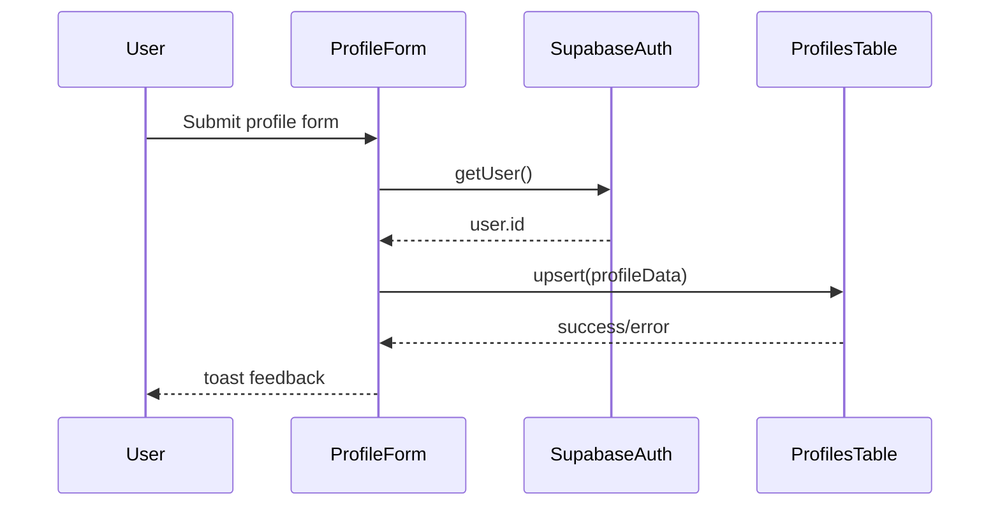

# Profile and Favorite Movies Flow

This flow documents profile creation/editing and top movie management.

## Entities touched

- `profiles`
  - `id` (same as auth user id)
  - `first_name`, `last_name`, `birthday`
  - `top_ten_movies` (JSON array)

## Initial profile load

Code references:

- `hooks/useProfile.ts`
- `app/(tabs)/profile.tsx`

`useProfile()`:

1. Gets current auth user
2. Reads `profiles` by `id`
3. Exposes `profile`, `profileLoading`, `refetch`

## Profile creation / edit

Code references:

- `components/ProfileForm/ProfileForm.tsx`

## Favorite movie updates

Code references:

- `components/EditCardsForm/EditsCardsForm.tsx`
- `components/Search/MovieSearch.tsx`

Two operations mutate `profiles.top_ten_movies`:

- **Delete one movie** -> `update({ top_ten_movies: updated })`
- **Add selected movies** -> merge + deduplicate + cap 10 -> `update({ top_ten_movies: merged })`

## Notes

- `ProfileForm` writes `top_ten_movies` only in create mode.
- `EditCardsForm` is the dedicated flow for updating picks after profile creation.
